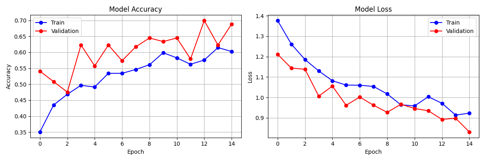

# ECG-Heart-Disease-Project
ECG image-based heart disease classification Dataset:
PRIMARY DATASET- Public ECG Image Dataset (Mendeley Data)
https://data.mendeley.com
SECONDARY DATASET- Reference: Khan, A.H., Hussain, M., Malik, M.K. (2021)
ECG Images Dataset of Cardiac and COVID-19 Patients
NIH-supported PhysioNet Dataset
PTB-XL: A Large Public ECG Dataset
Source: https://physionet.org/content/ptb-xl/1.0.3/
Used for validation and comparison

## Overview
This project classifies ECG images into 4 heart conditions using Deep Learning (CNN - MobileNetV2).

## Heart Conditions Detected
- Normal Heart
- Myocardial Infarction
- Abnormal Heartbeat
- History of Myocardial Infarction

## Dataset
- Total Images: 928
- Training: 745 images
- Validation: 183 images
- Classes: 4

## Model
- Architecture: MobileNetV2 (Transfer Learning)
- Framework: TensorFlow/Keras
- Accuracy: 65%

## Results

## Steps
1. Data Collection
2. Image Preprocessing
3. Train/Val Split (80/20)
4. Build CNN Model
5. Train Model
6. Evaluate Model
7. Prediction

## An Overview of Electrocardiogram (ECG or EKG)

An electrocardiogram records the electrical signals in the heart. It is a common, painless test used to detect heart problems and quickly monitor the heart's health.

It is used to determine or detect:
- Irregular heart rhythms (arrhythmias)
- Blocked or narrowed arteries causing chest pain or a heart attack
- Whether you have had a previous heart attack
- How well certain heart disease treatments are working

## Identifying Heart Disease from ECG Images with Deep Learning

This project uses a dataset of annotated ECG images and their corresponding heart disease labels to train a CNN (MobileNetV2) model to identify different heart conditions based on the input ECG image.

## Data Preprocessing

The original images were resized to 224x224 to make deep learning processing efficient. Images were normalized and augmented using rotation, zoom, and horizontal flip to improve model performance.

## CNN Architecture (MobileNetV2)

A lightweight convolutional neural network (CNN) architecture, MobileNetV2, is specifically designed for mobile and embedded vision applications. Google researchers developed it as an enhancement over the original MobileNet model. Another remarkable aspect of this model is its ability to strike a good balance between model size and accuracy, rendering it ideal for resource-constrained devices. And a deep learning model pre-trained on ImageNet. It uses depthwise separable convolutions for efficient feature extraction. The model was fine-tuned on our ECG dataset for 4-class classification.
The key innovation in MobileNetV2 is the use of inverted residual blocks 
with linear bottlenecks. Unlike traditional CNNs, it first expands the 
feature channels, applies depthwise convolution, then compresses back — 
This reduces computation while preserving accuracy.

For our ECG heart disease classification project, we used Transfer Learning 
with MobileNetV2 pre-trained on ImageNet. The final classification layers 
were replaced with custom Dense layers to classify ECG images into 4 categories:
- Normal Heart
- Myocardial Infarction  
- Abnormal Heartbeat
- History of Myocardial Infarction

The model achieved 65% validation accuracy on our dataset of 928 ECG images.

## Challenges & Improvements

During this project, I trained a MobileNetV2 CNN model on ECG images to classify 4 heart conditions. While the model achieved 65.57% validation accuracy, I continuously worked to improve it by increasing epochs from 15 to 30, applying weight decay in the optimizer, and experimenting with the EfficientNetB0 architecture.

The primary limitation was the small dataset size (928 images). Despite multiple optimization attempts, accuracy remained limited — which is expected with such a constrained dataset.

## Model Comparison

| Model | Dataset | Accuracy |
|-------|---------|----------|
| Our CNN (MobileNetV2) | 928 ECG Images | 65.57% |
| Reference ViT Model | 928 ECG Images (Same) | 86% |

Both models were trained on the same dataset of 928 ECG images. Despite using identical data, the ViT (Vision Transformer) model achieved 86% accuracy compared to our CNN model's 65.57%. This clearly demonstrates that ViT's self-attention mechanism learns better features from ECG images than standard CNN convolutions.

## Future Work

As suggested, the next phase of this project will use the PTB-XL ECG Signal Dataset from PhysioNet with a 1D CNN model for arrhythmia classification, which is expected to achieve significantly higher accuracy.
