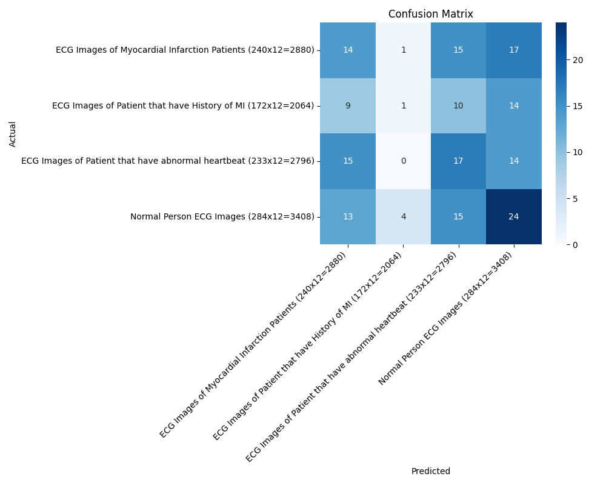
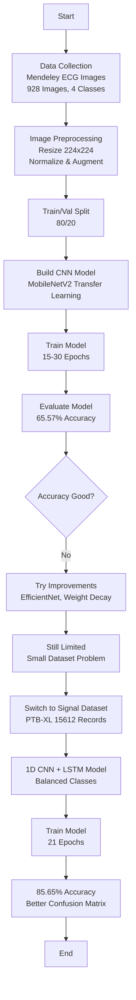
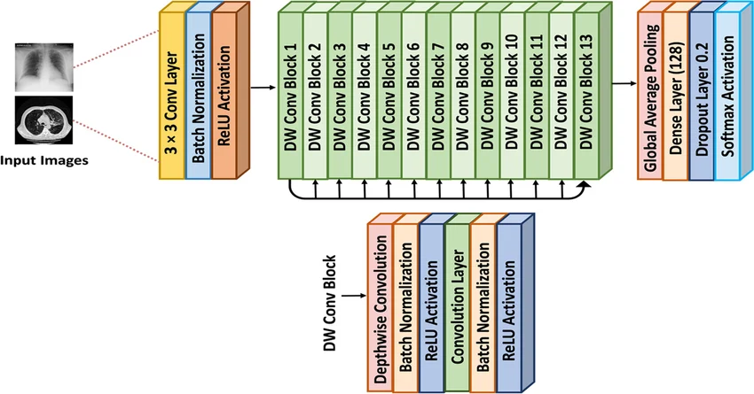

# ECG Image-Based Heart Disease Classification

## 📊 Dataset
- Source: Public ECG Image Dataset (Mendeley Data)  
- Link: https://data.mendeley.com  
- Used for validation and comparison

## 📌 Overview
This project classifies ECG images into four heart conditions using Deep Learning techniques. A Convolutional Neural Network (CNN) based on MobileNetV2 with transfer learning is used for multi-class classification.

## Heart Conditions Detected
- Normal
- Myocardial Infarction (MI)
- Abnormal Heartbeat
- History of Myocardial Infarction (HMI)

## 📊 Dataset
- Total Images: 928  
- Training Set: 745 images  
- Validation Set: 183 images  
- Number of Classes: 4  

## ⚙️ Model
- Architecture: MobileNetV2 (Transfer Learning)  
- Framework: TensorFlow / Keras  
- Validation Accuracy: ~65%  
- Fine-Tuning: Last 30 layers were unfrozen to improve performance  

## 📈 Results
### Training & Validation Performance

### Training & Validation Performance

- Model performance evaluated using Accuracy, Loss, and Confusion Matrix  
- Classification Report includes Precision, Recall, and F1-score

## 🔄 Project Workflow
1. Data Collection  
2. Image Preprocessing (Resizing, Normalization, Data Augmentation)  
3. Train/Validation Split (80/20)  
4. Model Building (MobileNetV2 - Transfer Learning)  
5. Model Training  
6. Fine-Tuning (Unfreezing last layers)  
7. Model Evaluation (Accuracy, Loss, Confusion Matrix, Classification Report)  
8. Prediction  

## Project Flowchart

## An Overview of Electrocardiogram (ECG or EKG)

An electrocardiogram (ECG or EKG) records the electrical activity of the heart over time. It is a non-invasive and painless test used to detect heart abnormalities and monitor overall cardiac health.

### It is used to detect:
- Irregular heart rhythms (arrhythmias)  
- Blocked or narrowed arteries (leading to chest pain or heart attack)  
- Previous heart attacks  
- Effectiveness of heart disease treatments

## 🧠 Identifying Heart Disease from ECG Images with Deep Learning

This project utilizes annotated ECG images to train a Convolutional Neural Network (MobileNetV2) for multi-class classification of heart conditions. The model learns to automatically extract meaningful features from ECG images and accurately predict the corresponding heart disease category.

## 🧪 Data Preprocessing

The input ECG images were resized to 224×224 for compatibility with the MobileNetV2 model. Pixel values were normalized using rescaling (1./255) to improve training stability.

Data augmentation techniques such as rotation, width shift, height shift, zoom, and horizontal flip were applied to enhance model generalization and reduce overfitting.

## 🧠 CNN Architecture (MobileNetV2)

  

MobileNetV2 is a lightweight Convolutional Neural Network (CNN) architecture designed for mobile and embedded vision applications. It is a deep learning model pre-trained on the ImageNet dataset and is widely used for efficient feature extraction.

The model uses depthwise separable convolutions, which significantly reduce computational cost while maintaining performance. A key innovation of MobileNetV2 is the use of inverted residual blocks with linear bottlenecks. Unlike traditional CNNs, it expands feature channels, applies depthwise convolution, and then compresses them back, improving efficiency without losing accuracy.

In this project, transfer learning was applied using MobileNetV2, and the model was fine-tuned by unfreezing the last 30 layers for improved performance in 4-class heart disease classification.

In this project, transfer learning was applied using MobileNetV2 pre-trained on ImageNet. The final classification layers were replaced with custom Dense layers to classify ECG images into four categories:

- Normal  
- Myocardial Infarction (MI)  
- Abnormal Heartbeat  
- History of Myocardial Infarction (HMI)  
The model achieved 65% validation accuracy on our dataset of 928 ECG images.

## ⚠️ Challenges & Improvements

In this project, a MobileNetV2-based CNN model was trained to classify ECG images into four heart conditions. The model achieved a validation accuracy of 65.57%.

Several improvements were attempted to enhance performance, including increasing the number of training epochs (from 15 to 30), applying weight decay, and experimenting with the EfficientNetB0 architecture.

The primary limitation was the small dataset size (928 images), which restricted the model’s ability to generalize effectively. Despite multiple optimization efforts, accuracy improvements remained limited due to this constraint.

## 📊 Model Comparison

| Model | Dataset | Accuracy |
|-------|--------|----------|
| MobileNetV2 (CNN) | 928 ECG Images | 65.57% |
| Vision Transformer (ViT) | 928 ECG Images | 86% |

Both models were trained on the same ECG image dataset. The Vision Transformer (ViT) achieved higher accuracy (86%) compared to the MobileNetV2 model (65.57%), indicating its superior ability to capture complex patterns using self-attention mechanisms.

However, ViT requires significantly higher computational resources (30GB+ RAM), which exceeds the limitations of free Google Colab environments. Therefore, MobileNetV2 was selected as a practical and efficient solution for resource-constrained settings.

## 🚀 Future Work
The next phase of this project focuses on ECG signal classification using the PTB-XL dataset from PhysioNet. A 1D CNN + LSTM model is applied for arrhythmia classification, achieving approximately 85.65% accuracy.

---

## 📚 References
- PTB-XL Dataset: https://physionet.org/content/ptb-xl/1.0.3/  
- MobileNetV2: Sandler et al. (2018), Google Research  
- ECG Image Dataset: https://data.mendeley.com  

---

## 🔗 Project 2 — ECG Signal Classification
After limited accuracy with image-based classification, the project was extended to ECG signal classification using the PTB-XL dataset.

👉 Check the full project here:  
[ECG Signal Classification](ECG-Signal-Classification/README.md)
